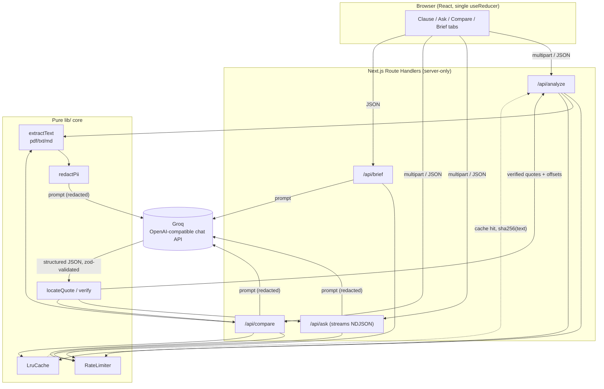

# Clause Compass

A GenAI assistant that reads a contract for you and maps every clause: what it means, what it
obligates you to, and how risky it is — every claim grounded in a verbatim quote from your own
document, never taken on faith.

> **This tool gives information, not legal advice.** It is not a substitute for a licensed
> attorney. For decisions that matter, talk to one.

## The problem

Contracts are written for lawyers, not for the person about to sign one. Rent agreements,
freelance contracts, and terms of service bury the clauses that actually matter — an uncapped
late fee, a mandatory arbitration clause, a landlord's right to enter without notice — inside
paragraphs of boilerplate. Most people sign anyway, because reading it carefully takes a lawyer's
training and an afternoon they don't have.

Generic AI chat can summarize a contract, but a summary you can't verify against the source is
just a second thing to trust blindly. Clause Compass's answer is **grounding**: every clause,
every consequence in a "what if" answer, and every quote in a document comparison is checked
against the actual document text server-side before it's shown. If a quote the model produced
can't be found verbatim in the source, the claim is marked unverified rather than presented as
fact.

## Features

### Clause map
Upload a contract (PDF, TXT, or Markdown) and get every clause identified, explained in plain
8th-grade English, tagged with its type and risk level (with a reason, not just a color), and
listed with the obligations it creates. Clauses the document is missing compared to similar
agreements are called out too.

_[screenshot: clause map, two-pane view with a clause selected and its quote highlighted]_

### What-if simulator
Ask "what happens if I pay late?" or "what if I end this early?" and get a short, direct answer
that streams in as it's generated, followed by a cited consequence chain — each step linked to
the exact sentence in the document that supports it. If the document doesn't address the
question, the tool says so explicitly instead of guessing.

_[screenshot: Ask tab mid-answer, with a consequence chain and a "Not verified" badge]_

### Compare mode
Upload a second document, or compare against a bundled "fair" baseline template, and see every
topic aligned side by side — changed, added, removed, or the same — with a plain-language
explanation of which version is better for the person signing.

_[screenshot: Compare tab, grouped by status with side-by-side quotes]_

### Lawyer-prep brief
A one-page, printable brief generated from the analysis: key risks, specific questions to ask a
lawyer, documents to gather, and any deadlines — with a checklist you can tick off, and one-click
copy, Markdown download, or print/save-as-PDF.

_[screenshot: the printed brief with the checklist]_

## Architecture



The server never persists anything: no database, no session, no document storage. Everything
needed to render a result — including the full extracted document text — is returned to the
client in the response and held only in that page's in-memory state. Reloading the page starts
over. The only server-side state is an in-memory, per-instance LRU cache keyed by the SHA-256 of
the document text, purely to avoid re-calling the model for an identical document within the same
process's lifetime.

## How grounding works

The model is never trusted to produce a citation offset — it can't see character positions, and
asking it to guess them produces confidently wrong numbers. Instead:

1. The model returns a **quote string** — instructed, in every prompt, to copy it verbatim from
   the document.
2. The server (`src/lib/grounding/locateQuote.ts`) searches for that quote in the *original*
   document text, after normalizing both sides: smart quotes and dashes are unified, whitespace
   (including line breaks the quote might wrap across) is collapsed, and the match is
   case-insensitive. A quote containing `...` or `…` is resolved by locating its first and last
   segments, in order, and spanning between them.
3. If the quote is found, its real `start`/`end` character offsets are computed from the
   *original*, unnormalized text, and the claim is marked `verified: true`. The document viewer
   uses those offsets to render an actual `<mark>` over the real source text.
4. If the quote can't be found, the claim isn't dropped — it's kept, but flagged
   `verified: false` and shown with a "Not verified" badge instead of a clickable highlight. The
   user sees what the model claimed and that it couldn't be confirmed, rather than either a
   silent omission or an unverified fact presented as if it were checked.

Compare mode grounds each side independently: a `docAQuote` is checked only against document A,
a `docBQuote` only against document B, never cross-checked against the other document. This is
covered by a test that gives the model a quote for the wrong document on purpose, to confirm the
mix-up gets caught rather than silently passing.

## Security and privacy

- **Stateless by design.** No database. Documents are processed in memory for the duration of one
  request and never written to disk; the only cache is in-memory, keyed by a hash of the text,
  with a TTL, and holds the *result* (clause analysis), not the source document.
- **PII redaction, on by default.** Before a document's text is sent to the model, an optional
  pass (`src/lib/security/redactPii.ts`) masks emails, phone numbers, card-like numbers, and
  Aadhaar/PAN-like ID numbers, replacing them with placeholders. Grounding still runs against the
  *original* text, so highlighting in the UI is unaffected; a clause whose quote happens to land
  on redacted text may simply come back unverified. The UI shows exactly what was masked and lets
  the user turn redaction off per request.
- **Prompt-injection resistance.** The document is always wrapped in `<document>` (or
  `<document_a>` / `<document_b>`) tags, and every system prompt explicitly instructs the model
  to treat that content as data, never as instructions — and to flag suspicious embedded
  instructions as a high-risk finding rather than follow them. A test sends a document containing
  an "ignore all previous instructions" attempt through the real pipeline and asserts it reaches
  the model wrapped in the delimiters, not as raw text.
- **Rate limiting.** Each AI route enforces a 10-requests-per-minute token bucket per client IP
  (`x-forwarded-for`-aware), returning `429` with `Retry-After`. This is explicitly a
  **per-instance, in-memory** limiter — on a multi-instance deployment it bounds each instance
  independently, not the service as a whole. It's a best-effort guard against accidental abuse,
  not a substitute for a gateway-level rate limiter.
- **No secrets on the client.** `src/lib/env.ts` and every module under `src/lib/ai/` are marked
  `server-only`; importing one from a client component fails the build. Verified by grepping the
  production client bundle for the API key and the Groq base URL — neither appears.
- **Typed, content-free errors.** Every route returns `{ error: { code, message } }` with a
  correct status code, never a raw stack trace. Server-side logging
  (`src/lib/security/logger.ts`) records only the route name, error code, and status — never
  document text, prompts, or model output.
- **Upload limits.** 10 MB per file, 120,000 extracted characters per document, and a combined
  200,000-character ceiling in Compare mode; only PDF, plain text, and Markdown are accepted.

## Accessibility

- Every risk and confidence level is shown with both an icon (a compass-style gauge) and text —
  never color alone.
- A skip link, semantic landmarks (`header` / `main` / `footer`), and a single `h1` (the site
  name) present on every screen, including loading and error states.
- The Clauses / Ask / Compare / Brief tabs follow the WAI-ARIA tabs pattern: arrow-key navigation
  with a roving `tabindex`, `aria-selected`, and matching `tabpanel`s.
- Visible focus rings throughout (`:focus-visible`), `aria-live` regions for async status
  (loading, streaming answers), and `prefers-reduced-motion` support (the compass spinner and all
  transitions are disabled).
- Color pairs were checked against WCAG AA (4.5:1) with a contrast calculation, not by eye — this
  caught and fixed two failing risk-badge colors during development.
- `@axe-core/playwright` runs against five real states (idle, results, error, an answered
  question, a generated brief) in CI and fails the build on any detected violation.

## Testing

- **Unit/integration (Vitest):** the entire pure core — schemas, text extraction, grounding,
  redaction, rate limiting, the Groq client wrapper, and every API route with the model call
  mocked (valid response, invalid-then-retry, total failure, oversized input, wrong MIME type,
  and the cross-document grounding check). ~200 tests, run with `npm run test`.
- **End-to-end (Playwright):** full user flows — upload → clause list → click-to-highlight in
  both directions; ask a question → cited answer; compare against a baseline; generate a brief —
  with `/api/*` mocked via route interception, so e2e runs need no real Groq key. Includes the
  five axe-core accessibility scans and explicit 375px-viewport checks. Run with
  `npm run test:e2e`.

## Setup

```bash
npm install
cp .env.example .env.local   # fill in GROQ_API_KEY
npm run dev
```

| Command | What it does |
|---|---|
| `npm run dev` | Start the dev server at `localhost:3000` |
| `npm run build` / `npm run start` | Production build / start |
| `npm run lint` | ESLint |
| `npm run typecheck` | `tsc --noEmit` |
| `npm run test` | Vitest unit/integration suite |
| `npm run test:e2e` | Playwright end-to-end suite (installs its own browser on first run: `npx playwright install chromium`) |

## Deploy (Google Cloud Run)

```bash
gcloud secrets create gemini-api-key --replication-policy=automatic
printf '%s' 'your-real-key' | gcloud secrets versions add gemini-api-key --data-file=-

PROJECT_ID=your-project REGION=us-central1 ./scripts/deploy.sh
```

The script builds the multi-stage `Dockerfile` (Node 22 alpine, non-root user, Next's
`output: "standalone"`) with Cloud Build, then deploys to Cloud Run with `--min-instances 0`
(scales to zero) and the API key mounted from Secret Manager — never as a plain environment
variable.

## Limitations

- Grounding confirms a quote is *present*, not that the model's interpretation of it is correct —
  a verified badge means "this text exists in your document," not "this legal analysis is right."
- PII redaction is a best-effort regex pass over common patterns, not exhaustive PII detection.
- The in-memory rate limiter and cache are per-instance; they reset on redeploy and don't
  coordinate across multiple running instances.
- No OCR: a scanned (image-only) PDF with no text layer will extract as empty and be rejected.
- This is a hackathon-scope project. It has not been audited by a lawyer, and clause type
  detection and risk framing reflect the training and judgment of a general-purpose language
  model, not jurisdiction-specific legal expertise.

## Disclaimer

Clause Compass gives information about what a document says. It does not give legal advice, does
not create an attorney-client relationship, and should not be relied on as a substitute for
review by a licensed attorney — especially before signing anything binding.
